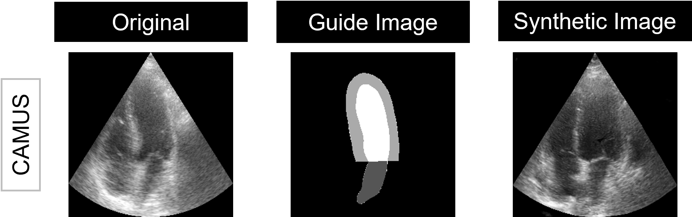

# Domain Translation With an Adversarial Denoising Diffusion Model to Generate Synthetic Datasets of Echocardiography Images

Repository for code from the paper "A Domain Translation Framework With an Adversarial Denoising Diffusion Model to Generate Synthetic Datasets of Echocardiography Images", available [here](https://ieeexplore.ieee.org/document/10049068).


## Overview

This repository contains the scripts to train a 2D Adversarial Diffusion Model (DDM), in order to generate 2D echocardiography images (associated with anatomical masks). 

The generative model relies on a DDM and a GAN to generate 2D echocardiography images, while the training process is conditioned using anatomical masks of the heart.

After cloning this repository and to use the scripts, it is recommended to create a conda environment, activate it, and then install the required libraries.


## Dataset
You will have to define your training and validation datasets in .mat files, in the following way:

```
input_path/
  ├── data_test_img.mat
  ├── data_test_lab.mat
  ├── data_train_img.mat
  ├── data_train_lab.mat
  ├── data_val_img.mat
  ├── data_val_lab.mat
```


## Training

This code was tested on Ubuntu 22.04 and four NVIDIA GeForce RTX 2080 Ti GPUs. Furthermore it was developed using Python v3.10.

```
python trainRight.py --image_size 256 --exp (experiment name) --num_channels 2 --num_channels_dae 64 --ch_mult 1 1 2 2 4 4 --num_timesteps 4 --num_res_blocks 2 --batch_size 2 --contrast1 img --contrast2 lab --num_epoch 1000 --ngf 64 --embedding_type positional --use_ema --ema_decay 0.999 --r1_gamma 1. --z_emb_dim 256 --lr_d 1e-4 --lr_g 1.6e-4 --lazy_reg 10 --num_process_per_node 4 --save_content --local_rank 3 --input_path (path to training and validation datasets) --output_path (path where to save the training results)

```


## Inference

```
python test.py --image_size 256 --exp (experiment name) --num_channels 2 --num_channels_dae 64 --ch_mult 1 1 2 2 4 4 --num_timesteps 4 --num_res_blocks 2 --batch_size 1 --embedding_type positional --z_emb_dim 256 --contrast1 img --contrast2 lab --which_epoch 980 --gpu_chose 3 --input_path (path to test dataset) --output_path (path where to save the generated samples)
```


## Synthetic Image (example)




## Citation

Please acknowledge this work and cite the paper as:

```
@article{tiago_domain_2023,
	 title = {A Domain Translation Framework With an Adversarial Denoising Diffusion Model to Generate Synthetic Datasets of Echocardiography Images},
	 volume = {11},
	 issn = {2169-3536},
	 doi = {10.1109/ACCESS.2023.3246762},
	 journal = {IEEE Access},
	 author = {Tiago, Cristiana and Snare, Sten Roar and Šprem, Jurica and McLeod, Kristin},
	 year = {2023},
	 pages = {17594--17602}
	}
```


## Acknowledgments
This code uses libraries from [SynDiff](https://github.com/icon-lab/SynDiff), [pGAN](https://github.com/icon-lab/pGAN-cGAN), [StyleGAN-2](https://github.com/NVlabs/stylegan2), and [DD-GAN](https://github.com/NVlabs/denoising-diffusion-gan) repositories.
