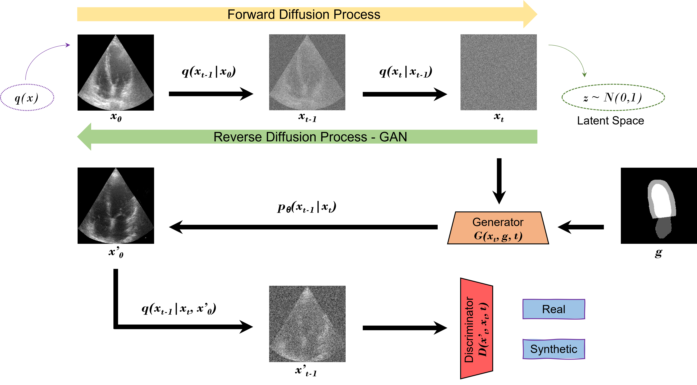

# Domain Translation With an Adversarial Denoising Diffusion Model to Generate Synthetic Datasets of Echocardiography Images

Repository for code from the paper "A Domain Translation Framework With an Adversarial Denoising Diffusion Model to Generate Synthetic Datasets of Echocardiography Images", available [here](https://ieeexplore.ieee.org/document/10049068).


## Overview

This repository contains the scripts to train a 2D Adversarial Diffusion Model (DDM), in order to generate 2D echocardiography images (associated with anatomical masks). 

The generative model relies on a DDM and a GAN to generate 2D echocardiography images, while the training process is conditioned using anatomical masks of the heart.

After cloning this repository and to use the scripts, it is recommended to create a conda environment, activate it, and then install the required libraries.




## Dataset
You will have to define your training and validation datsets in .mat files, in the following way:

```
input_path/
  ├── data_test_img.mat
  ├── data_test_lab.mat
  ├── data_train_img.mat
  ├── data_train_lab.mat
  ├── data_val_img.mat
  ├── data_val_lab.mat
```


## Training

This code was tested on Ubuntu 20.04 and an NVIDIA GeForce RTX 2080 Ti GPU. Furthermore it was developed using Python v3.6.

```
pyhton train.py --dataroot (path to your dataroot folder) --batchSize 2 --depthSize 32 --input_nc 1 --output_nc 1 --which_model_netG unet_256 --which_model_netD n_layers --name (experiment name) --dataset_mode nodule --model pix2pix3d --nThreads 4 --no_flip --loadSize 256 --fineSize 256 --niter 100 --niter_decay 100 --pool_size 50 --norm batch --which_direction AtoB
```


## Inference

```
pyhton test.py --dataroot (path to your dataroot folder)  --results_dir (path where to save the generated images) --ntest 1 --how_many 1 --batchSize 1 --depthSize 32 --input_nc 1 --output_nc 1 --which_model_netG unet_256 --which_model_netD n_layers --name (experiment name) --dataset_mode single --model test --nThreads 4 --no_flip --loadSize 256 --fineSize 256 --norm batch --which_direction AtoB --which_epoch 50
```


## Citation

Please acknowledge this work and cite the paper as:

```
@article{tiago_data_2022,
	 title = {A Data Augmentation Pipeline to Generate Synthetic Labeled Datasets of 3D Echocardiography Images Using a GAN},
	 volume = {10},
	 issn = {2169-3536},
	 doi = {10.1109/ACCESS.2022.3207177},
	 journal = {IEEE Access},
	 author = {Tiago, Cristiana and Gilbert, Andrew and Beela, Ahmed Salem and Aase, Svein Arne and Snare, Sten Roar and Šprem, Jurica and McLeod, Kristin},
	 year = {2022},
	 pages = {98803--98815}
        }
```


## Acknowledgments
This code uses libraries from [SynDiff](https://github.com/icon-lab/SynDiff), [pGAN](https://github.com/icon-lab/pGAN-cGAN), [StyleGAN-2](https://github.com/NVlabs/stylegan2), and [DD-GAN](https://github.com/NVlabs/denoising-diffusion-gan) repositories.
